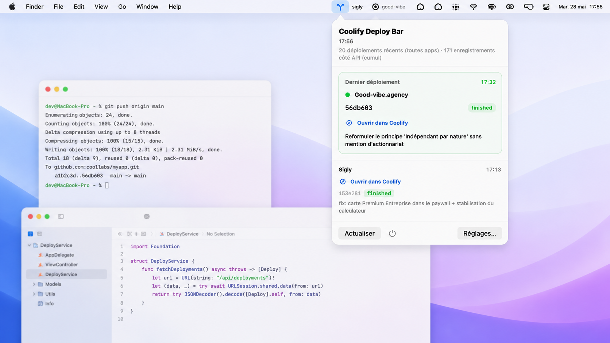

# CoolifyDeployBar



[](https://github.com/julienferla/coolifydeploybar)
[](https://github.com/julienferla/coolifydeploybar/releases)
[](https://github.com/julienferla/coolifydeploybar/releases/latest)
[](https://github.com/sponsors/julienferla)

> macOS menu bar companion for [Coolify](https://coolify.io): watch deployment queue and open your Coolify dashboard with a Bearer token.

  

## Premier lancement / First launch

> macOS will show **"CoolifyDeployBar is damaged"** the first time you open it. This is Gatekeeper refusing an unsigned app, not a corrupted file. The DMG is not signed with an Apple Developer ID (no $99/year subscription on this project).

**Once after install**, run this in Terminal :

```bash
xattr -dr com.apple.quarantine /Applications/CoolifyDeployBar.app
```

Then open the app normally. Subsequent launches work without warning.

Alternative without Terminal : right-click on the app in Finder → **Open** → confirm in the dialog.

## Features

- **Deployment queue** — polls Coolify HTTP API v1 for queued / in-progress deployments
- **Settings** — base URL (e.g. `https://coolify.example.com`) and API token (stored in the macOS Keychain)
- **Menu bar** — `MenuBarExtra` popover + system Settings scene for configuration

## Requirements

- macOS 14 (Sonoma) or later
- Xcode 15+ or Swift 5.9 toolchain (for local builds)
- A Coolify instance with a **personal access token** (Bearer) and API v1 enabled

## Getting started

```bash
git clone https://github.com/julienferla/coolifydeploybar.git
cd coolifydeploybar
swift build
swift run CoolifyDeployBar
```

### Où est l’app après un build ?

| Comment tu buildes | Emplacement |
| --- | --- |
| **Xcode** (⌘B / ⌘R) | Dans le **DerivedData** de Xcode : `~/Library/Developer/Xcode/DerivedData/CoolifyDeployBar-*/Build/Products/Debug/CoolifyDeployBar.app` (ou **Release** si tu as changé le schéma). Dans Xcode : menu **Product → Show Build Folder in Finder** pour ouvrir le dossier du produit. |
| **`swift build -c release`** | Pas de `.app` : exécutable seulement, chemin affiché par `swift build -c release --show-bin-path` → en général **`.build/arm64-apple-macosx/release/CoolifyDeployBar`**. |
| **`make dmg`** | Le script assemble un `.app` temporaire sous **`build/dmg_stage/`** et le DMG final dans **`dist/CoolifyDeployBar-<version>.dmg`**. |

### Xcode (recommandé — même flux qu’une app macOS classique)

Ouvre le projet généré **CoolifyDeployBar.xcodeproj** (cible Application macOS, `Packaging/Info.plist`, signature automatique possible avec ton équipe) :

```bash
make open
# ou : xed CoolifyDeployBar.xcodeproj
```

Puis **⌘R**. Dans **Signing & Capabilities**, choisis ton **Team** pour un binaire signé (évite les blocages Gatekeeper par rapport au seul exécutable SPM).

Le fichier **`project.yml`** sert de source de vérité pour [XcodeGen](https://github.com/yonaskolb/XcodeGen). Pour régénérer le `.xcodeproj` après modification des dossiers ou des réglages :

```bash
brew install xcodegen   # une fois
xcodegen generate
```

### Swift Package (sans Xcode)

```bash
xed Package.swift
```

Puis run avec **⌘R** sur le package (exécutable `CoolifyDeployBar`).

### Configuration

1. Open **Settings** (CoolifyDeployBar menu or system Settings).
2. Set **Coolify base URL** (no trailing slash), e.g. `https://coolify.example.com`.
3. Paste your **API token** (same value you would send as `Authorization: Bearer …`).

API reference: [Coolify API](https://coolify.io/docs/api-reference/authorization).

## Releases (DMG)

**Télécharger l’app :** [toutes les releases](https://github.com/julienferla/coolifydeploybar/releases) · [dernière release (DMG)](https://github.com/julienferla/coolifydeploybar/releases/latest)

Maintainers:

1. Bump **`CFBundleShortVersionString`** / **`CFBundleVersion`** in [`Packaging/Info.plist`](Packaging/Info.plist) when you cut a release (the DMG script also sets short version from the Git tag).
2. Create a **GitHub Release** (publish). Tag may be `v1.0.0` or `1.0.0`.
3. Workflow [`.github/workflows/release-dmg.yml`](.github/workflows/release-dmg.yml) builds on `macos-14` and uploads **`CoolifyDeployBar-<version>.dmg`** to that release.

### Gatekeeper : signature et notarisation (maintainers)

Pour supprimer définitivement l’avertissement « endommagé » côté utilisateur (voir [Premier lancement](#premier-lancement--first-launch) en haut du README), il faut un compte Apple Developer Program et la notarisation Apple :

1. Signer avec **Developer ID Application** : le script `make-dmg.sh` signe automatiquement si la variable d’environnement `CODESIGN_IDENTITY` est définie.
2. Notariser via Apple `notarytool` puis attacher le ticket avec `stapler`.
3. Brancher tout ça dans le workflow CI (secrets GitHub : certificat .p12, mot de passe app-specific, Team ID).

Local DMG (Xcode / Swift notarized separately if you ship outside GitHub):

```bash
make dmg
# → dist/CoolifyDeployBar-<version>.dmg
```

## Project layout

```
CoolifyDeployBar.xcodeproj/    # App macOS (XcodeGen → project.yml)
project.yml                    # Définition XcodeGen (cible, Info.plist, déploiement)
Sources/CoolifyDeployBar/
├── CoolifyDeployBarApp.swift   # @main, MenuBarExtra + Settings
├── API/
├── Models/
├── Services/
├── Settings/
└── Views/
Packaging/
└── Info.plist                   # App bundle metadata for DMG packaging
scripts/
└── make-dmg.sh                  # swift build + .app + hdiutil
```

## License

MIT — see [LICENSE](LICENSE).
